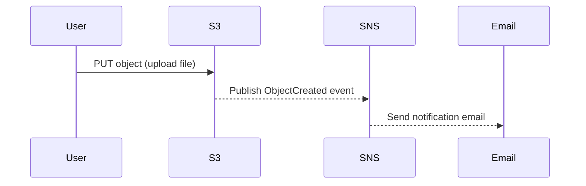

# Architecture

```mermaid
flowchart LR
  A[Client uploads file] --> B[S3 Bucket]
  B -- ObjectCreated event --> C[SNS Topic]
  C --> D[Email Subscriber(s)]
```
 
**Flow**  
1) A user uploads a file to the S3 bucket.  
2) S3 emits an **ObjectCreated** event.  
3) The bucket's Event Notification forwards it to an **SNS topic**.  
4) SNS delivers an **email** to each confirmed subscriber.
 

