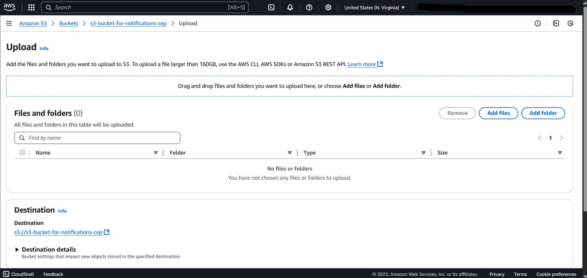
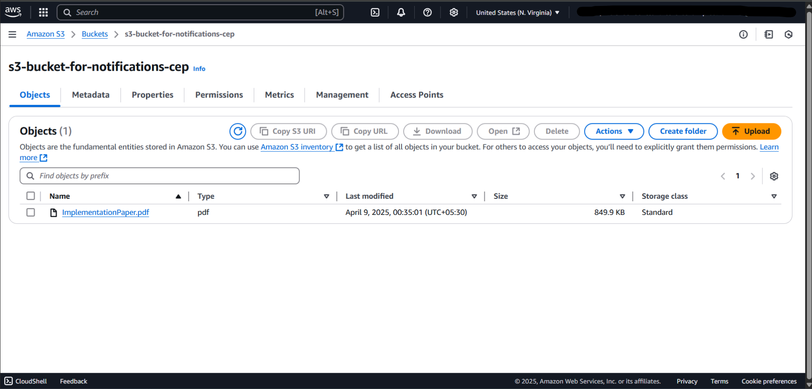
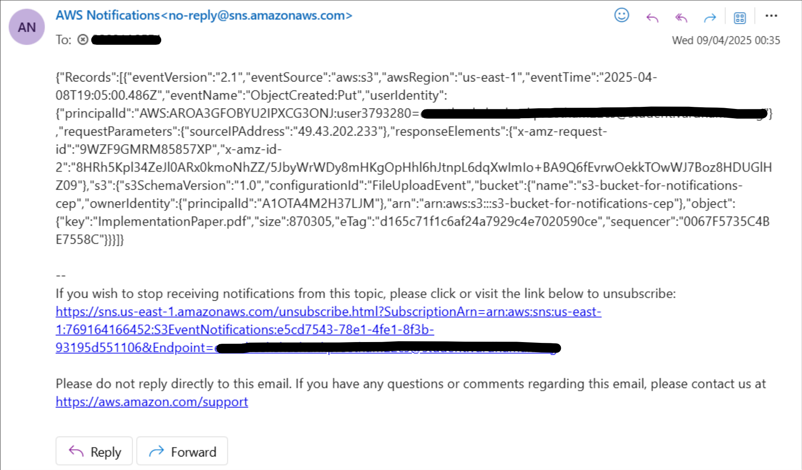

# AWS S3 → SNS Email Notifications

A small, event-driven setup on AWS: when a file is **uploaded to Amazon S3**, an **SNS topic** sends an **email** to subscribed users. This demonstrates cloud-native integration with **no custom compute** (serverless, decoupled alerts).

## What & Why
- **What:** Automatic email alert on every new object in an S3 bucket.
- **Why:** Simple, low-maintenance notifications for audit trails, ingestion pipelines, or team updates; producers (S3) and consumers (email/other systems) stay loosely coupled.

## How It Works
1. **S3** emits an **ObjectCreated** event when a file is uploaded.  
2. The bucket’s **Event notifications** forward that event to an **SNS topic**.  
3. **SNS** fans out and delivers an **email** to each confirmed subscription.  
4. A topic policy allows `s3.amazonaws.com` to publish **only** from this bucket’s ARN.

## Reproduce (AWS Console)
1. **Create SNS topic** → *Standard* → name it (e.g., `S3EventNotifications`).  
2. **Create email subscription** to the topic → confirm from your inbox.  
3. **Create S3 bucket** (same region as the topic).  
4. In the bucket: **Properties → Event notifications → Create**  
   - Event types: **All object create events**  
   - Destination: **SNS topic** → select your topic  
5. **Test:** upload any file to the bucket → check your email for the notification.

## Screenshots (Outcome)
**1. Add Files in S3**  
  
*Open the bucket and click **Add files** to start an upload.*

**2. Upload Confirmation**  
  
*Select the files and click **Upload** (triggers ObjectCreated).*

**3. Email Notification**  
  
*Amazon SNS delivers the message to the subscribed address.*

> More captions: see `OUTCOME_CAPTIONS.md`.

## Architecture
High-level flow diagrams are in **ARCHITECTURE.md**.

## Repo Structure
```
README.md
ARCHITECTURE.md
docs/
  1.png
  2.png
  3.png
OUTCOME_CAPTIONS.md
s3_object_created_event.json
sns_email_example.txt
```
